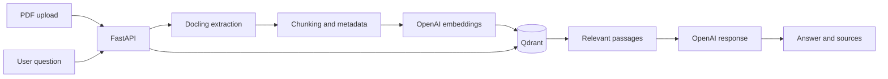

# AI Document Assistant

A full-stack Retrieval-Augmented Generation (RAG) application for asking source-grounded questions about PDF documents. The assistant extracts document content, creates embeddings, retrieves relevant passages from Qdrant, and uses an OpenAI model to generate answers with page-level source references.

## Features

- Upload and process one or multiple PDF documents
- Extract structured content with Docling
- Split document text into overlapping chunks
- Generate OpenAI embeddings for semantic retrieval
- Store and query vectors in Qdrant
- Ask questions across all documents or within one selected document
- Display the source document, page range, and similarity score
- Open the referenced PDF directly at the relevant page
- Responsive React and TypeScript interface
- Configurable API URLs, CORS origins, chunk sizes, and upload limits

## Architecture



## Technology stack

| Layer | Technologies |
| --- | --- |
| Frontend | React, TypeScript, Vite, Tailwind CSS, TanStack Query |
| Backend | Python, FastAPI, Uvicorn |
| Document processing | Docling |
| AI | OpenAI Responses API, OpenAI embeddings, RAG |
| Vector database | Qdrant |
| Testing | Vitest, Testing Library, pytest |

## Prerequisites

- Python 3.11 or newer
- Node.js 20 or newer
- An OpenAI API key
- A Qdrant Cloud cluster or another accessible Qdrant instance

## Local setup

### 1. Clone the repository

```bash
git clone https://github.com/dempsylee1704-tech/AI-Document-Assistant.git
cd AI-Document-Assistant
```

### 2. Configure the backend

Create a virtual environment and install the Python dependencies:

```bash
cd backend
python -m venv .venv
```

Activate the environment on Windows:

```powershell
.venv\Scripts\Activate.ps1
```

Activate it on macOS or Linux:

```bash
source .venv/bin/activate
```

Then install the dependencies:

```bash
pip install -r requirements.txt
```

Copy the example configuration to `.env` in the repository root and insert your own credentials:

```bash
cp ../.env.example ../.env
```

Never commit the completed `.env` file.

Start the API from the `backend/app` directory:

```bash
cd app
uvicorn api:app --reload --host 127.0.0.1 --port 8000
```

The API documentation is available at `http://127.0.0.1:8000/docs`. The health endpoint is available at `http://127.0.0.1:8000/health`.

### 3. Configure the frontend

Open another terminal:

```bash
cd frontend
npm ci
```

Optionally copy `frontend/.env.example` to `frontend/.env` when the backend runs at a different URL. Then start the frontend:

```bash
npm run dev
```

Open `http://localhost:8080` in your browser.

## Environment variables

| Variable | Purpose | Default |
| --- | --- | --- |
| `OPENAI_API_KEY` | OpenAI authentication | Required |
| `QDRANT_URL` | Qdrant instance URL | Required |
| `QDRANT_API_KEY` | Qdrant authentication | Required for Qdrant Cloud |
| `PUBLIC_BASE_URL` | Public backend URL used in source links | `http://127.0.0.1:8000` |
| `ALLOWED_ORIGINS` | Comma-separated frontend origins | Local development URLs |
| `CHUNK_CHAR_SIZE` | Target chunk size in characters | `1024` |
| `CHUNK_CHAR_OVERLAP` | Character overlap between chunks | `200` |
| `MAX_UPLOAD_SIZE` | Maximum PDF size in bytes | `26214400` |
| `VITE_API_BASE_URL` | Backend URL used by the frontend | `http://127.0.0.1:8000` |

## Quality checks

Frontend:

```bash
cd frontend
npm run lint
npm run test
npm run build
```

Backend unit tests:

```bash
cd backend
pip install -r requirements-dev.txt
pytest
```

## API overview

| Method | Endpoint | Description |
| --- | --- | --- |
| `GET` | `/health` | Check whether the API is running |
| `GET` | `/documents` | List processed documents |
| `POST` | `/upload` | Upload and process one PDF |
| `POST` | `/upload-multiple` | Upload and process multiple PDFs |
| `POST` | `/ask` | Ask a question across one or all documents |
| `GET` | `/pdf/{doc_id}` | Open the original PDF for a source reference |

## Current limitations

- Only PDF files are supported.
- Document processing runs as an in-process background task and is intended for development or portfolio use.
- OpenAI and Qdrant credentials are required for an end-to-end run.
- Uploaded documents are stored locally and should not contain confidential information when running a public deployment.

## Security

- Keep `.env` files, API keys, uploaded PDFs, and processed document data out of version control.
- Rotate an API key immediately if it has ever been committed or shared publicly.
- Configure explicit CORS origins and deployment-specific URLs before publishing the application.
